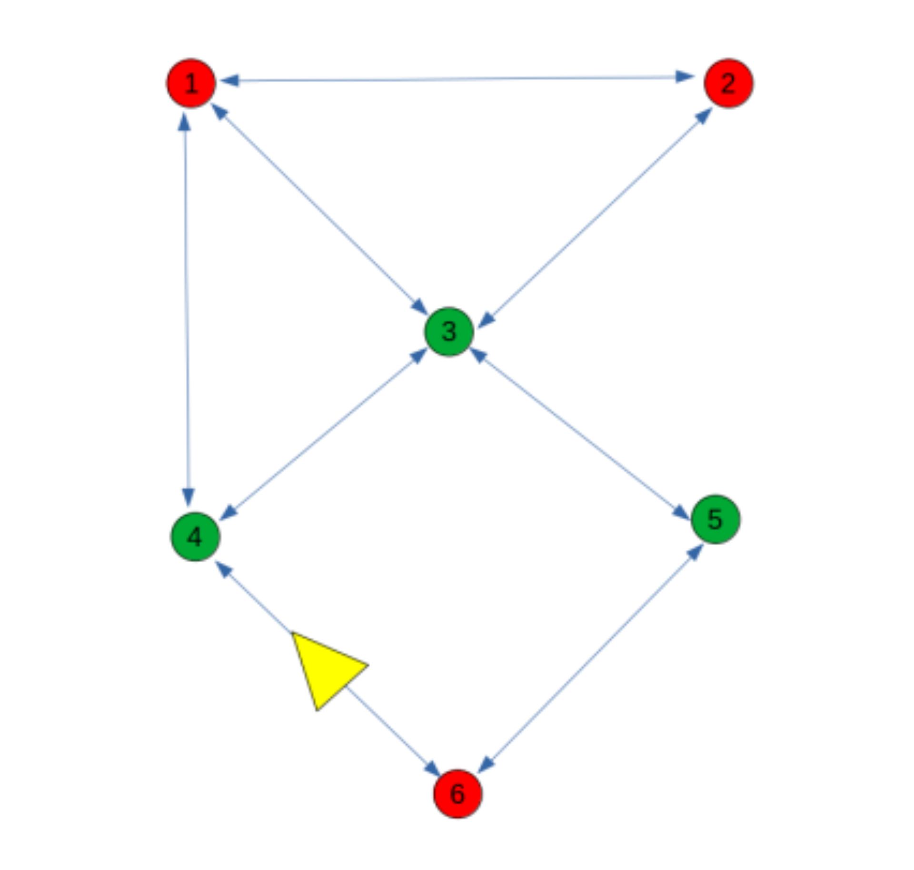

# waypoint_navigation



This package does planning and navigation to the goal waypoint throught shortest path.

## [View Demo Video](https://drive.google.com/file/d/1bQ8AxHoTOHwkVaLGyLWngporGGeXUoO3/view?usp=sharing)


## 💡 What It Does

- Subscribes to odometry to locate the robot.
- Loads waypoints and their connections from a JSON file.
- Finds the nearest waypoint to current robot pose.
- Computes the shortest path using Dijkstra.
- Navigates through the computed path using `nav2`'s `NavigateToPose` action.


## 🧑‍💻 Setup

1. 📂 Clone the repository
```
mkdir -p ~/ros_ws/src
cd ~/ros_ws/src
git clone  https://github.com/manojm-dev/waypoint_navigation.git
```

2) 📦 Install dependencies
```
cd ~/ros_ws
sudo apt-get update -y && rosdep update && rosdep install --from-paths src --ignore-src -y
```

3) 🛠️ Building the packages
```
cd ~/ros_ws
colcon build
```

## 🛠️ Parameters

These can be passed via `--ros-args` cmd:

- `odom_topic` (odometery topic, default: `/odom`)
- `json_path` (path to json file, default: `waypoint_navigation/data/waypoints.json`)
- `waypoint_goal` (name of final destination waypoint, default: `F`, input: `A` to `F` in the current setup)
- `waypoint_limit` (max number of waypoints to process, default: `100`)


## 🚀 Run the Node

```bash
ros2 run waypoint_navigation waypoint_navigator --ros-args -p waypoint_goal:="B"
```

## 📄 JSON Format (example)

```json
[
    {
        "id": 0,
        "name": "A",
        "neighbours": [
            "B",
            "C",
            "D"
        ],
        "x": 0.000000000000000,
        "y": 0.000000000000000
    },
    ...
}
```

## 👨‍💻 Author
Made with ❤️ by Manoj M